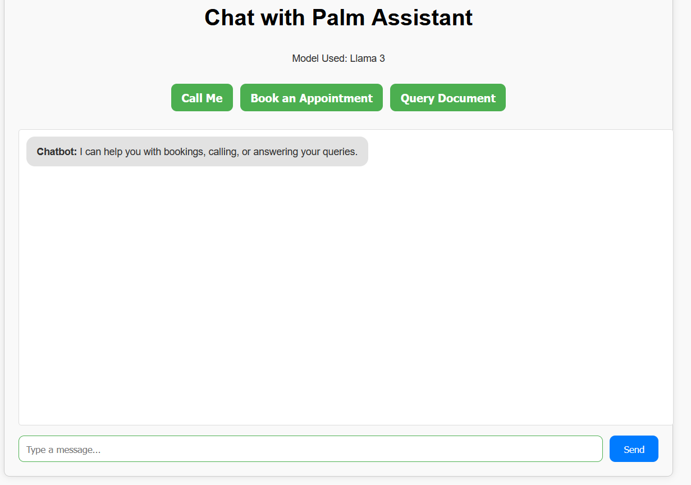
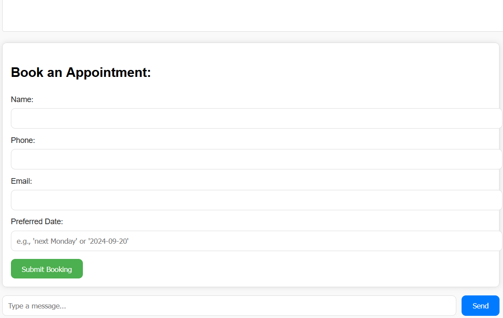
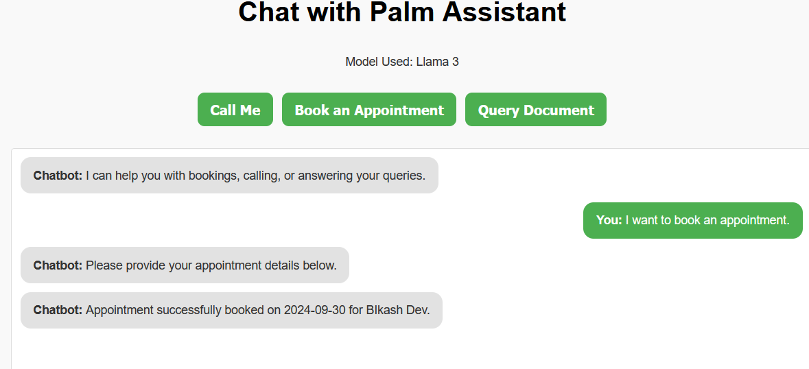

# Conversational Chatbot

Develop a chatbot capable of answering user queries based on any uploaded documents while incorporating a conversational form to collect user information (such as Name, Phone Number, and Email) when the user requests a callback. The project leverages LangChain and Gemini (or any suitable large language models) to handle the chatbot's functionality.

Additionally, the chatbot integrates a conversational form for booking appointments, utilizing tool agents to manage this process. The form also extracts full date formats (e.g., YYYY-MM-DD) from user queries, such as "Next Monday," and validates user inputs like email addresses and phone numbers to ensure accuracy and completeness.

This project provides a collection of utilities for natural language processing (NLP) tasks, validation functions (such as email and phone number validation), and configuration management using Pydantic, YAML, and other useful libraries like `dateutil` for date parsing. It also includes components for integrating and managing machine learning models, such as Language Learning Models (LLMs) and FAISS vector stores.


## Features

- **Email & Phone Validation**: Utilities to validate email addresses and phone numbers using regular expressions.
- **Natural Language Date Extraction**: Extract dates from user input using natural language parsing, returning them in `YYYY-MM-DD` format.
- **Configuration Management**: Load application configurations from a YAML file and environment variables using `dotenv`. This includes support for directories, document splitting, embeddings, memory configurations, and LLMs.
- **FAISS Index Management**: Load, save, and manage FAISS vector indexes using Hugging Face embeddings.
- **LLM Integration**: Interact with language models (LLMs) such as Groq, utilizing prompt templates to generate responses based on retrieved documents.

## Installation

To install and set up the project, follow these steps:

1. **Clone the repository:**

    ```bash
    git clone https://github.com/devbikash24/chatbot_PalmMind.git
    cd your-repo-name
    ```

2. **Create a virtual environment and activate it:**

    ```bash
    python3 -m venv venv
    source venv/bin/activate  # On Windows: venv\Scripts\activate
    ```

3. **Install the required dependencies:**

    ```bash
    pip install -r requirements.txt
    ```

4. **Set up environment variables:**

    Create a `.env` file in the root of your project and add the following environment variables:

    ```bash
    SECRET_KEY=your-secret-key
    GROQ_ENV=your-groq-api-key
    ```

5. **Set up the configuration file:**

    Ensure you have a `config.yaml` file inside the `configuration/` directory. Here's a sample configuration structure:

    ```yaml
    directories:
      directories_for_docs: "data/docs"
      persist_directory: "data/persist"
      faiss_folder_for_index: "data/faiss/faiss_index"
      faiss_folder: "data/faiss"
      allowed_extension: ['pdf', 'txt', 'docx']

    splitter_config:
      chunk_size: 500
      chunk_overlap: 50

    embeddings:
      model: "sentence-transformers/all-MiniLM-L6-v2"
      top_k: 5

    llm_config:
      model_name: "llama3-8b-8192"
      llm_system_role: "You are a helpful assistant."
      temperature: 0.7
      max_tokens: 200

    memory:
      number_of_q_a_pairs: 10
    ```


# Screenshots

## When App Loads First Time


## Conversational form example


## Response Example



